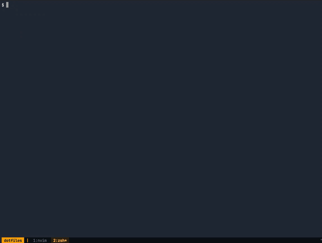
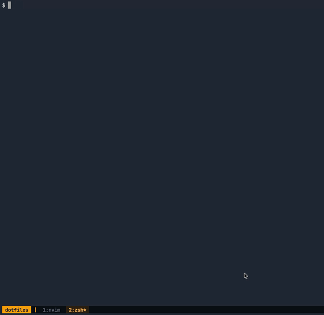

# dotfiles

Personal setup scripts for macOS and Debian/Ubuntu-based systems.

## Installation

Clone the repository.

For most users, HTTPS is the recommended option:

```bash
git clone https://github.com/Miklakapi/dotfiles.git ~/.dotfiles
cd ~/.dotfiles
```

If you already have GitHub SSH access configured, you can use SSH instead:

```bash
git clone git@github.com:Miklakapi/dotfiles.git ~/.dotfiles
cd ~/.dotfiles
```

## Setup scripts

Run all setup scripts:

```bash
./run
```

This runs all executable scripts from the `runs/` directory in alphabetical order:

```text
bin core docker fonts git golang node nvim python tmux zsh
```

Run only one setup script:

```bash
./run core
./run nvim
./run tmux
```

Available setup scripts:

| Script   | Description                                                                                                                                                   |
| -------- | ------------------------------------------------------------------------------------------------------------------------------------------------------------- |
| `bin`    | Adds custom dotfiles commands from `bin/` to `PATH` in `~/.zshrc` and installs `lsof` if needed.                                                              |
| `core`   | Installs common CLI tools used by the rest of the setup.                                                                                                      |
| `docker` | Installs Docker on Ubuntu using the official Docker repository and adds the current user to the `docker` group.                                               |
| `fonts`  | Installs JetBrains Mono Nerd Font using Homebrew on macOS or downloads it manually on Linux.                                                                  |
| `git`    | Installs Git, applies global Git defaults, asks for missing user details, and optionally configures `repo-clone` environment variables.                       |
| `golang` | Installs Go using Homebrew on macOS or the official Go tarball on Ubuntu, then adds Go paths to `~/.zshrc`.                                                   |
| `node`   | Removes old nvm configuration, installs fnm, configures it in `~/.zshrc`, and installs the latest Node.js version.                                            |
| `nvim`   | Installs Neovim dependencies, downloads Neovim on Ubuntu, clones or updates the Neovim config, and adds `vim=nvim` alias to `~/.zshrc`.                       |
| `python` | Installs uv, installs a Python version through uv, and configures uv shell integration in `~/.zshrc`.                                                         |
| `tmux`   | Installs tmux and clipboard support, copies the tmux config, and optionally configures tmux project directories in `~/.zshrc`.                                |
| `zsh`    | Installs Zsh, sets it as the default shell on Linux, and configures prompt, colors, completion, file suffix aliases, `zmv`, and pager defaults in `~/.zshrc`. |

Preview what would be executed without running the scripts:

```bash
./run --dry
./run nvim --dry
```

### Zsh file helpers

The `zsh` setup configures suffix aliases for opening files directly from the shell.

Examples:

```bash
README.md
package.json
index.html
main.go
app.log
```

Default behavior:

| File type                                                      | Action                                    |
| -------------------------------------------------------------- | ----------------------------------------- |
| Code files like `.go`, `.js`, `.ts`, `.php`, `.lua`, `.py`     | Opens in `nvim`                           |
| Text/config files like `.md`, `.txt`, `.yaml`, `.toml`, `.env` | Opens with `bat`                          |
| `.json`                                                        | Formats with `jq` and previews with `bat` |
| `.html`, `.htm`                                                | Serves the file directory with `serve`    |
| `.log`                                                         | Opens with `less`                         |

The setup also loads `zmv` for batch renaming in Zsh:

```bash
zmv '(*).log' '$1.txt'
```

`less` is configured with useful defaults for logs and long output:

```bash
export LESS='-R -S -i -M'
```

## Commands

Custom commands are stored in the `bin/` directory.

After running:

```
./run bin
```

they are available from anywhere in the terminal.

| Command         | Usage                                     | Description                                                                                                              |
| --------------- | ----------------------------------------- | ------------------------------------------------------------------------------------------------------------------------ |
| `kill-port`     | `kill-port 3000`                          | Kills processes listening on a given port.                                                                               |
| `port-info`     | `port-info 3000`                          | Shows processes listening on a given port.                                                                               |
| `net-info`      | `net-info`                                | Shows current network status, connection type, IP addresses, gateway, DNS, and MAC address.                              |
| `ensure-docker` | `ensure-docker`                           | Ensures Docker is running; starts Docker Desktop on macOS or shows a Linux start command.                                |
| `repo-update`   | `repo-update`                             | Updates clean Git repositories one level below the current directory and reports repositories that need attention.       |
| `repo-clone`    | `repo-clone [query\|git-url]`             | Finds one of your GitHub repositories or clones a direct Git URL, then opens it with `tmuxs`.                            |
| `repo-connect`  | `repo-connect <repo>`                     | Connects the current Git repository to a GitHub remote and pushes the current branch when possible.                      |
| `backup`        | `backup <file-or-directory>`              | Creates a timestamped copy of a file or directory next to the original.                                                  |
| `serve`         | `serve [path] [port]`                     | Serves a file or directory over HTTP using `uv` or `python3`.                                                            |
| `prod-preview`  | `prod-preview [--previous [number]]`      | Shows commits and a summary of changes that will reach production.                                                       |
| `ssh-host`      | `ssh-host`                                | Interactively creates an SSH host entry and can generate a new SSH key if needed.                                        |
| `search`        | `search [query]`                          | Searches project files with `ripgrep`, previews matches with `bat`, and opens the selected result in your editor.        |
| `tmuxs`         | `tmuxs [project-path]`                    | Selects a project with `fzf`, opens or switches to its tmux session, and runs project startup scripts.                   |
| `tmuxk`         | `tmuxk`                                   | Selects one or more tmux sessions with `fzf` and kills them, running project `.mkdev/tmux-close` scripts when available. |
| `repo-tag`      | `repo-tag <major\|minor\|patch\|version>` | Creates or updates a Git tag, pushes the current branch, and pushes the tag to the remote.                               |
| `project-new`   | `project-new [project-name]`              | Creates a new empty project in one of `TMUX_PROJECT_DIRS`, optionally initializes Git, and can open it with `tmuxs`.     |

### `repo-clone`

Finds repositories from your GitHub account, lets you select one with `fzf`, clones it if needed, and opens it with `tmuxs`.

It uses the `GITHUB_OWNER` and `REPO_CLONE_DIR` variables configured by:

```bash
./run git
```

<p align="center">
  
</p>

### `search`

Interactive project search powered by `ripgrep`, `fzf`, and `bat`.

It updates results as you type, shows a highlighted preview on the right, and opens the selected match in `$VISUAL`, `$EDITOR`, `nvim`, or `vim`.

<p align="center">
  
</p>

### `tmuxs`

Opens projects as tmux sessions.

Without arguments, it shows projects from `TMUX_PROJECT_DIRS` and `TMUX_PROJECTS` in `fzf`.
If the selected project already has an open tmux session, it switches to it.
Otherwise, it creates a new session, sets project-specific tmux environment variables, and runs `.mkdev/tmux-session` if available.

The project list shows markers for useful context:

```text
[S] open tmux session
[G] git repository
[C] local .mkdev/tmux-session
[B] local ./bin
```

<p align="center">
  
</p>

### `tmuxk`

Lets you select one or more running tmux sessions with `fzf` and kill them safely.

If a selected session has `TMUX_PROJECT_ROOT` configured and the project contains an executable `.mkdev/tmux-close` file, it runs that script before killing the session.

<p align="center">
  
</p>

### `port-info`

Shows which process is listening on a given port.

Example output:

```text
PORT     PID        COMMAND        ADDRESS        USER
3000     12345      node           *:3000         kacper
```

### `net-info`

Shows a compact overview of the current network connection.

Example output:

```text
Network
-------

Status:       online
Connection:   Wi-Fi
Wi-Fi name:   MyNetwork
Local IP:     192.168.1.24
Public IP:    203.0.113.10
Gateway:      192.168.1.1
DNS:          1.1.1.1, 8.8.8.8
MAC address:  aa:bb:cc:dd:ee:ff
```

### `prod-preview`

Shows a production-oriented preview for the current Git repository.

By default, it compares the current branch with `main` or `master`.
With `--previous`, it shows historical merge ranges from the production branch.

Example output:

```text
Production preview
Repository: my-app
Base: origin/main
Current: feature/orders-export
Range: current branch to production

Summary:
  Commits: 3
  Changes: 5 files changed, 120 insertions(+), 18 deletions(-)

Commits:
  2026-06-17 10:14  Add order export endpoint
  2026-06-17 10:42  Update export permissions
  2026-06-17 11:05  Fix production export filters
```

### `ssh-host`

Helps create an SSH host entry in `~/.ssh/config`.

It asks for a host alias, hostname, user, and key name. If the key does not exist, it can generate a new `ed25519` SSH key.

Example generated config:

```sshconfig
Host github.com
  HostName github.com
  User git
  IdentityFile ~/.ssh/github
  IdentitiesOnly yes
```

## Project workflow

This setup is project-oriented rather than workspace-oriented.

Global commands from this repository are available everywhere after running `./run bin`.
When a project is opened with `tmuxs`, it gets its own tmux session and project-specific environment.

A project can define local automation files:

| File                  | Purpose                                                                                                                                                      |
| --------------------- | ------------------------------------------------------------------------------------------------------------------------------------------------------------ |
| `.mkdev/tmux-session` | Runs when a new tmux session is created for the project. It can create windows, start development servers, open editors, or prepare the project environment. |
| `.mkdev/tmux-close`   | Runs before `tmuxk` kills the project session. It can stop containers, shut down background processes, or clean up local resources.                          |
| `.tmux-ignore`        | Excludes the project from the `tmuxs` project picker.                                                                                                        |

When `tmuxs` opens a project, it also checks for a local `./bin` directory.
If it exists, it is added to `PATH` only inside that tmux session.

This gives each project its own commands without making them globally available.

Example project layout:

```text
my-project/
  bin/
    dev
    test-api
  .mkdev/
    tmux-session
    tmux-close
```

Example `.mkdev/tmux-session`:

```bash
#!/usr/bin/env bash

tmux rename-window editor
tmux send-keys "nvim" C-m

tmux new-window -n server
tmux send-keys "npm run dev" C-m
```

Example `.mkdev/tmux-close`:

```bash
#!/usr/bin/env bash

docker compose down
```

## Test Ubuntu setup

Build test image:

```bash
docker build -f tests/ubuntu.Dockerfile -t dotfiles-ubuntu .
```

Run test container:

```bash
docker run --rm -it dotfiles-ubuntu
```

Remove test image:

```bash
docker rmi dotfiles-ubuntu
```

